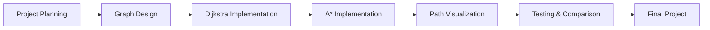
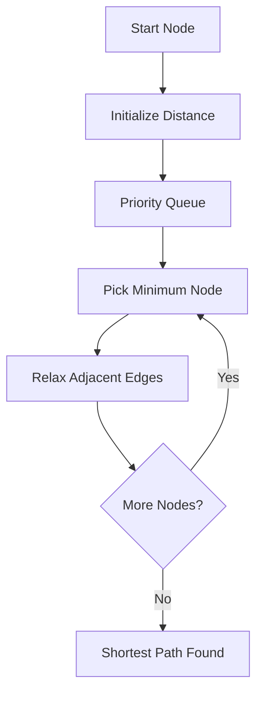

# 🚦 Smart City Road Network Simulator

<div align="center">


### A DSA-based shortest path simulator using Dijkstra's and A* algorithms

</div>

---

## 📌 Project Overview

The **Smart City Road Network Simulator** is a **Problem-Based Learning (PBL)** project that demonstrates how navigation systems calculate the shortest route between two locations using graph algorithms.

Instead of relying on real maps, the city is represented as a **weighted graph**, making this project an excellent demonstration of Data Structures and Algorithms.

### 🎯 Objectives

- Represent a city as a weighted graph.
- Implement **Dijkstra's Algorithm**.
- Implement **A* Search Algorithm**.
- Compare both algorithms.
- Visualize the shortest route.
- Build a portfolio-worthy DSA project.

---

# 🌆 Project Concept

In this simulator,

- 🟢 Nodes represent locations or intersections.
- 🛣️ Edges represent roads.
- ⚖️ Edge weights represent travel distance or cost.

Example:

```text
          Hospital
             ●
           3 |
             |
 School ●---2---● Market
     |            |
   4 |            | 5
     |            |
     ●------------●
    Home      Bus Stand
```

---

# 🧠 DSA Concepts Used

| Concept | Purpose |
|----------|---------|
| Graph | Represent road network |
| Weighted Graph | Store road distances |
| Adjacency List | Efficient graph storage |
| Priority Queue | Optimize Dijkstra |
| Heuristic | Used in A* |
| Path Reconstruction | Display shortest path |

---

# 🏗️ Development Workflow

The project follows this roadmap.



---

# 📅 Step-by-Step Development Plan

## Phase 1 — Project Setup

### Tasks

- [x] Select project topic
- [x] Decide algorithms
- [ ] Create GitHub repository
- [ ] Create project folder structure
- [ ] Prepare initial README

### Deliverables

- Project proposal
- GitHub repository
- Initial documentation

---

## Phase 2 — Graph Implementation

Represent the city as a weighted graph.

### Example

```text
A ----5---- B
| \         |
2  \1       3
|   \       |
C ----4---- D
```

### Adjacency List

```cpp
A -> (B,5), (C,2)
B -> (A,5), (C,1), (D,3)
C -> (A,2), (B,1), (D,4)
D -> (B,3), (C,4)
```

### Tasks

- [ ] Create Graph class
- [ ] Add nodes
- [ ] Add weighted edges
- [ ] Print graph

---

## Phase 3 — Dijkstra Algorithm

### Purpose

Find the shortest route between two locations.

### Workflow



### Complexity

| Metric | Complexity |
|---------|------------|
| Time | O((V+E) logV) |
| Space | O(V) |

### Tasks

- [ ] Initialize distances
- [ ] Use min heap
- [ ] Update shortest distances
- [ ] Store parent nodes
- [ ] Reconstruct path

---

## Phase 4 — A* Search

### Purpose

Improve route searching using heuristics.

Formula:

```text
f(n) = g(n) + h(n)
```

Where

- `g(n)` = distance travelled
- `h(n)` = estimated distance remaining

## 🏗️ Development Workflow


### Comparison

| Feature | Dijkstra | A* |
|----------|-----------|------|
| Shortest Path | ✅ | ✅ |
| Uses Heuristic | ❌ | ✅ |
| Faster on Maps | ❌ | ✅ |

### Tasks

- [ ] Add heuristic function
- [ ] Calculate f-score
- [ ] Compare with Dijkstra

---

## Phase 5 — Route Visualization

Display the calculated route.

Example Output

```text
Source: Home
Destination: Hospital

Route:

Home
 ↓
School
 ↓
Market
 ↓
Hospital

Total Distance = 9 km
```

Future improvements

- Traffic simulation
- Road closures
- Ambulance priority routing
- Dynamic route updates

---

# 📂 Project Structure

```text
Smart-City-Road-Network-Simulator/
│
├── README.md
├── LICENSE
├── .gitignore
│
├── docs/
│   ├── Proposal.pdf
│   ├── PPT/
│   └── Images/
│
├── src/
│   ├── main.cpp
│   ├── graph.cpp
│   ├── graph.h
│   ├── dijkstra.cpp
│   ├── dijkstra.h
│   ├── astar.cpp
│   ├── astar.h
│   └── utils.cpp
│
├── data/
│   └── city_map.txt
│
├── tests/
│   └── test_cases.cpp
│
└── output/
    └── sample_output.txt
```

---

# ⚙️ Algorithms Used

## Dijkstra

Best for

- Weighted graphs
- Guaranteed shortest path

Uses

- Priority Queue
- Distance Array
- Parent Array

---

## A* Search

Best for

- Navigation systems
- Faster searching

Uses

- Priority Queue
- Heuristic Function
- f-score calculation

---

# 📊 Algorithm Comparison

| Feature | Dijkstra | A* |
|----------|-----------|------|
| Guaranteed Shortest Path | ✅ | ✅ |
| Priority Queue | ✅ | ✅ |
| Heuristic | ❌ | ✅ |
| Navigation Friendly | ❌ | ✅ |
| Time Complexity | O((V+E)logV) | Depends on heuristic |

---

# 🧪 Testing Plan

Test cases

- [ ] Simple graph
- [ ] Multiple shortest paths
- [ ] Large graph
- [ ] Disconnected graph
- [ ] Same source and destination
- [ ] Invalid node input

Example

| Source | Destination | Expected |
|----------|--------------|------------|
| Home | Hospital | Shortest path |
| School | Bus Stand | Correct route |
| A | A | Distance = 0 |

---

# 🚀 Future Scope

- Real map integration
- Google Maps API
- Live traffic simulation
- Emergency vehicle routing
- Road blockage handling
- Multi-city support

---

# 👥 Team Members

| Name | Role |
|------|------|
| Nitish Joshi | Graph, Dijkstra, Documentation |
| Saiyam Verma | A* Algorithm |
| Pankaj Chaubey | Testing & Visualization |

---

# 📚 Learning Outcomes

This project demonstrates practical implementation of

- Graph Data Structure
- Weighted Graphs
- Priority Queue
- Dijkstra's Algorithm
- A* Search Algorithm
- Complexity Analysis
- C++ STL
- Real-world application of DSA

---

# ⭐ Project Milestones

| Phase | Status |
|--------|---------|
| Planning | ✅ Completed |
| Graph Design | ⏳ In Progress |
| Dijkstra | ⏳ Pending |
| A* | ⏳ Pending |
| Visualization | ⏳ Pending |
| Testing | ⏳ Pending |
| Final Submission | ⏳ Pending |

---

<div align="center">

### ⭐ If you found this project interesting, consider giving it a star!

*"Algorithms power the roads we travel—even before the journey begins."*

</div>
